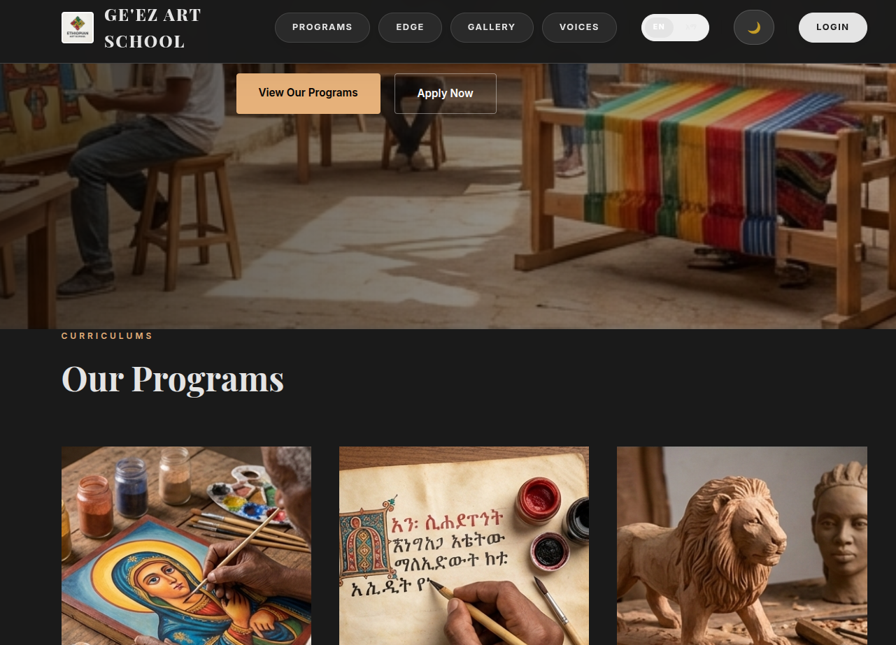
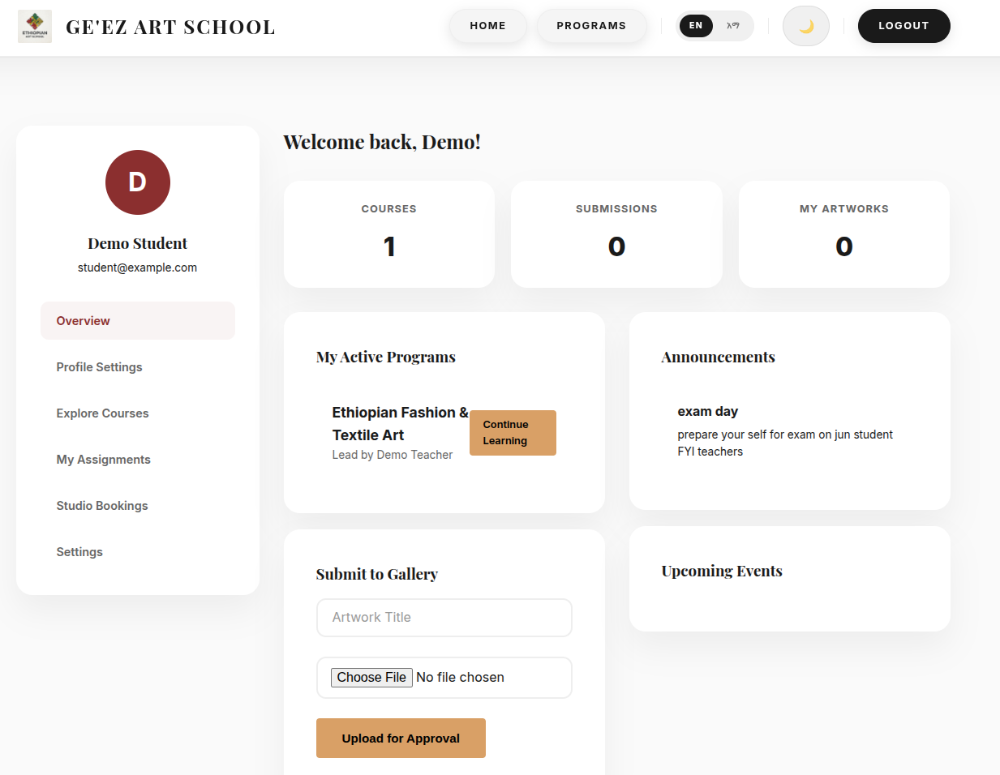
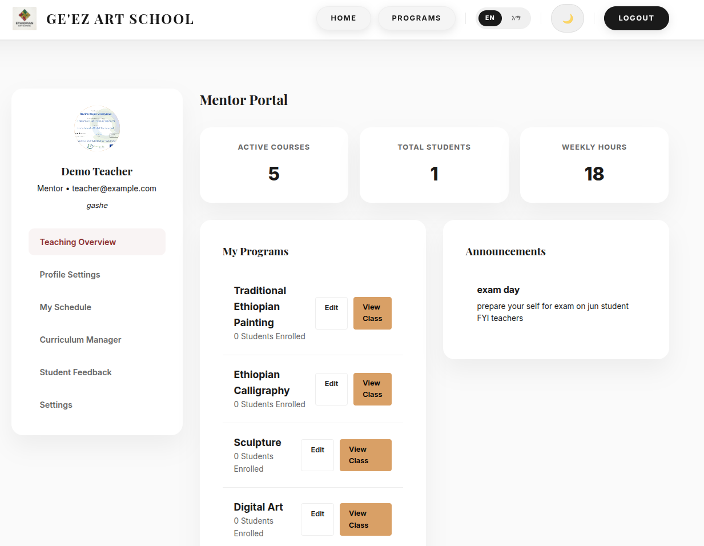
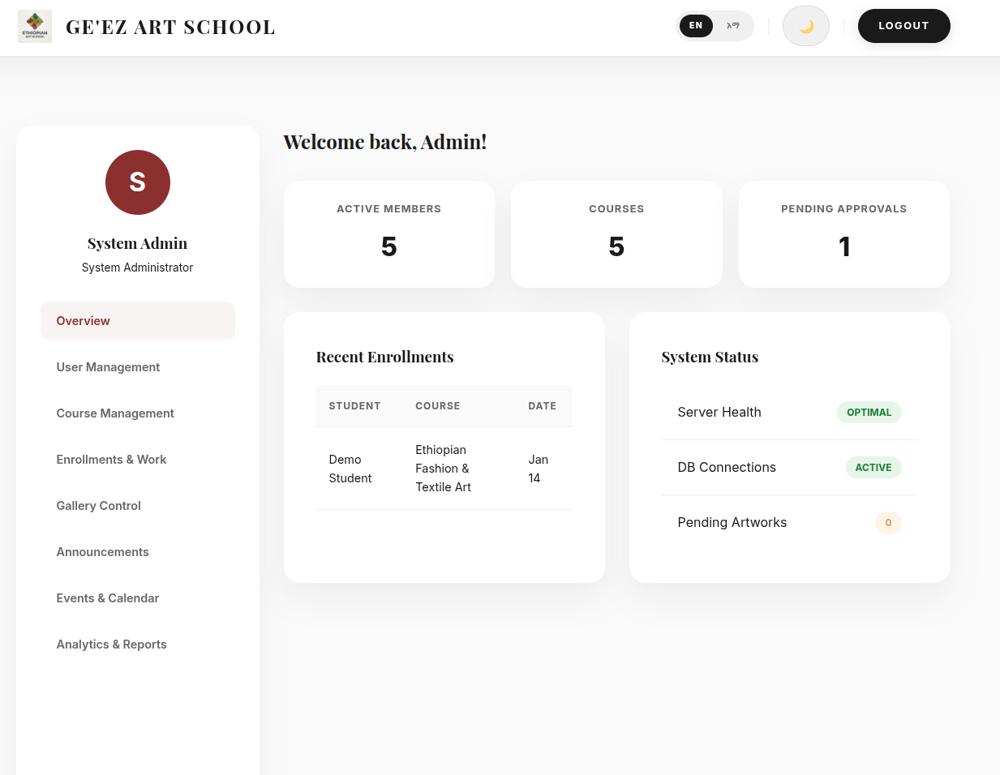

Ge'ez Art School — Full-Stack Educational Platform
Ge'ez Art School is a comprehensive web platform dedicated to Ethiopian traditional and contemporary art education. It bridges the gap between cultural heritage and modern digital learning by providing a localized, role-based environment for students, mentors, and administrators.

🚀 Critical Features & Architecture
1. Role-Based Access Control (RBAC)
The platform is built on a strict three-tier permission system:

Student: Course enrollment, progress tracking, and artwork submission.

Teacher/Mentor: Course creation, curriculum management, and student submission review.

Admin: Full system moderation, user management, and platform analytics.

2. Security Implementation
To ensure a production-ready environment, the following patterns are enforced:

SQL Injection Prevention: All database interactions use MySQLi prepared statements with parameter binding.

Credential Security: Passwords are never stored in plain text; the platform uses password_hash() with the PASSWORD_DEFAULT algorithm.

Session Integrity: Server-side session validation ensures users can only access data relevant to their assigned role.

3. Localization (i18n)
The platform features a custom translation engine supporting:

English

Amharic (ግዕዝ): Full regional script support across all UI components and dashboards.

The system supports bilingual usage (English and Amharic) and includes a dark/light mode toggle for accessibility and user preference.

🛠 Tech Stack
Frontend: Vanilla HTML5, CSS3 (Custom Variables for Dark Mode), JavaScript (ES6+).

Backend: PHP 7.4+.

Database: MySQL 5.7+ (Relational schema with Foreign Key constraints).

Server: Apache.

📸 Platform Preview

### ✨ Screenshots

- 🏠 **Landing Page**  
    
  Clean public homepage showcasing the platform vision, navigation, and access points for users.

- 🎓 **Student Dashboard**  
    
  Personalized student workspace for enrolled courses, progress tracking, and artwork submissions.

- 👨‍🏫 **Mentor Dashboard**  
    
  Mentor area for managing courses, monitoring learners, and reviewing submitted artwork.

- 🛡️ **Admin Dashboard**  
    
  Administrative control panel for moderation, user oversight, and platform-wide operations.

🗄 Database Schema Highlights
The system relies on a relational MySQL structure to maintain data integrity across educational workflows:

Users: Stores profiles and hashed credentials.

Courses: Links teachers to specific syllabi and learning materials.

Artworks: Manages the submission-to-gallery workflow (Pending → Approved → Featured).

Enrollments: A junction table managing the many-to-many relationship between students and courses.

⚡ Quick Start
Clone the project into your htdocs or /var/www/html directory.

Configure php/db.php with your local database credentials.

Initialize the system by visiting: http://localhost/art-school-website/php/setup.php.

Login using a demo account (e.g., admin@example.com / adminpass).